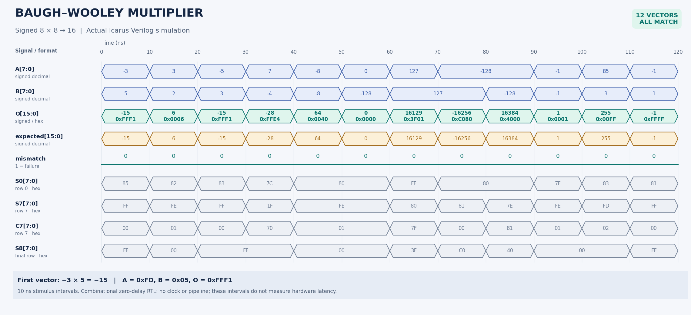

# Baugh–Wooley Signed Multiplier

An exact **8-bit × 8-bit signed multiplier** implemented in **Python** and **structural SystemVerilog**, with a worked example, exhaustive tests, and a real simulation waveform.

The default design takes two two's-complement operands, `A[7:0]` and `B[7:0]`, and produces `O[15:0]`. The parameterized core also supports operand widths of at least 2 bits. Its datapath uses partial products, half adders, and full adders; it does not use a multiplication operator.

| Property | Default configuration |
|---|---|
| Arithmetic | Exact signed two's-complement multiplication |
| Operand range | −128 to +127 |
| Result format | Signed 16-bit two's complement |
| Partial-product terms | 64 AND terms; 14 sign-cross terms complemented |
| Adder cells | 15 half adders and 49 full adders |
| Sign correction | Constant ones in product columns 8 and 15 |
| Timing model | Combinational; no clock, reset, or pipeline registers |

## Quick start

Extract this repository and run commands from its top-level folder.

```bash
# No installation or third-party Python packages required for the model.
python3 -m baugh_wooley --a -3 --b 5 --width 8 --trace
make test
```

The first three lines are:

```text
A =     -3  bits = 11111101
B =      5  bits = 00000101
O =    -15  bits = 1111111111110001  hex = 0xFFF1
```

For RTL simulation, install **Icarus Verilog** (`iverilog` and `vvp`) and **GNU Make**. On Ubuntu/Debian:

```bash
sudo apt-get update
sudo apt-get install iverilog make python3-venv
make sim
make exhaustive
make crosscheck
```

To regenerate the waveform images and run every check:

```bash
python3 -m venv .venv
source .venv/bin/activate
python -m pip install -r requirements-waveform.txt
make verify PYTHON=python
```

Python 3.9 or later is supported. Matplotlib is required only to regenerate images. The included images and VCD can be viewed without installing Python packages.

## Simulation waveform



[Vector version](docs/waveform.svg) · [Simulator VCD](docs/example.vcd) · [Exact sampled data](docs/waveform_data.json)

This figure is rendered from the actual VCD produced by `tb/tb_waveform.sv`. Each input pair is held for **10 ns by the testbench**. Values are checked after a 1 ns settling interval. The RTL itself contains no delay statements or registers; these intervals do **not** describe circuit latency or maximum clock frequency. The bus shapes show settled values rather than physical gate-delay transitions.

`expected` is the testbench's signed multiplication oracle. `mismatch` is 1 when `O` differs from that oracle; it remains 0 for every shown interval. `S0`, `S7`, `C7`, and `S8` are selected internal sum/carry rows, displayed in hexadecimal.

| Interval (ns) | A | B | Signed O | O, hexadecimal |
|---|---:|---:|---:|---|
| 0–10 | −3 | 5 | −15 | `FFF1` |
| 10–20 | 3 | 2 | 6 | `0006` |
| 20–30 | −5 | 3 | −15 | `FFF1` |
| 30–40 | 7 | −4 | −28 | `FFE4` |
| 40–50 | −8 | −8 | 64 | `0040` |
| 50–60 | 0 | −128 | 0 | `0000` |
| 60–70 | 127 | 127 | 16129 | `3F01` |
| 70–80 | −128 | 127 | −16256 | `C080` |
| 80–90 | −128 | −128 | 16384 | `4000` |
| 90–100 | −1 | −1 | 1 | `0001` |
| 100–110 | 85 | 3 | 255 | `00FF` |
| 110–120 | −1 | 1 | −1 | `FFFF` |

To inspect the signals interactively, install GTKWave and run:

```bash
make view
# Or open the already included simulation:
gtkwave docs/example.vcd
```

Add `tb_waveform.A`, `B`, `O`, `expected`, and `mismatch` to the viewer. Select signed decimal display for `A`, `B`, `O`, and `expected`, and hexadecimal for the internal rows.

## Why Baugh–Wooley changes some partial products

An $n$-bit signed operand has a negative weight on its most significant bit:

$$
A = -a_{n-1}2^{n-1} + \sum_{i=0}^{n-2} a_i2^i.
$$

Start with the ordinary bit products:

$$
p_{i,j} = a_i \land b_j.
$$

The terms involving exactly one sign bit have negative weights. Baugh–Wooley turns those into positive-weight complemented bits, so a regular adder array can process them.

Define the transformed partial products:

$$
q_{i,j} =
\begin{cases}
\overline{p_{i,j}}, & \text{exactly one of } i,j \text{ equals } n-1,\\
p_{i,j}, & \text{otherwise}.
\end{cases}
$$

The sign × sign corner, $p_{n-1,n-1}$, is retained because multiplying two negative bit weights gives a positive weight. The complete result is:

$$
O = \left(\sum_{i=0}^{n-1}\sum_{j=0}^{n-1} q_{i,j}2^{i+j}
          + 2^n + 2^{2n-1}\right) \bmod 2^{2n}.
$$

Complementing the sign-cross terms introduces an offset of $2^{2n-1}-2^n$. The two correction bits add $2^{2n-1}+2^n$, making the combined offset $2^{2n}$, which disappears when keeping the lower $2n$ bits. This is why the correction ones are necessary.

For the 8-bit design, all 64 terms are generated: the 49 non-sign terms and the sign × sign corner stay as ANDs; the 7 sign-row and 7 sign-column cross terms are inverted.

## Worked example: 4-bit −3 × 5

Use a smaller width to see every step. `A = 1101₂` represents −3 and `B = 0101₂` represents +5. The expected 8-bit result is −15.

Each partial-product row is written with `j = 3` at the left and `j = 0` at the right. Its product weight is determined by shifting it left by row index `i`.

| Row i | Raw `A[i] AND B[3:0]` | Transformed row q | Shifted into 8 product columns | Decimal contribution |
|---:|---|---|---|---:|
| 0 | `0101` | `1101` | `00001101` | 13 |
| 1 | `0000` | `1000` | `00010000` | 16 |
| 2 | `0101` | `1101` | `00110100` | 52 |
| 3, sign row | `0101` | `0010` | `00010000` | 16 |

1. **Generate the bit products.** For example, `A[0] = 1`, so raw row 0 equals `B`.
2. **Complement the sign-cross terms.** In rows 0–2, invert column 3. In row 3, invert columns 0–2 and retain column 3.
3. **Add the transformed rows.** Their sum is `13 + 16 + 52 + 16 = 97`.
4. **Add the correction ones.** For `n = 4`, add `2⁴ + 2⁷ = 16 + 128 = 144`.
5. **Interpret the result.** `97 + 144 = 241 = 11110001₂`. Its sign bit is 1, so the signed value is `241 − 256 = −15`.

Run this exact example:

```bash
python3 -m baugh_wooley --a -3 --b 5 --width 4 --trace
```

## How the SystemVerilog follows your RTL

`rtl/mul_reference.sv` preserves the supplied 8-bit array's `U9`–`U72`, `S_i_j`, `C_i_j`, and `PDKGENHAX1` / `PDKGENFAX1` names. Its top module is renamed `mul_reference` so it can be simulated beside the parameterized implementation.

| Stage | Supplied RTL | New core | Operation |
|---|---|---|---|
| Partial products / row 0 | `S_0_0`–`S_0_7` and inline AND terms | `pp[r][j]`, `s[0]` | Generate bit products and complement sign-cross terms |
| First reduction row | `U9`–`U16` | `gen_first_row`, `first_correction` | 8 HAs; inject the correction one at product column 8 |
| Remaining reduction rows | `U17`–`U64` | `gen_reduction_row` | Each row uses 7 FAs and 1 edge HA; row 7 uses sign-row terms |
| Final addition | `U65`–`U72` | `final_first`, `gen_final_row`, `final_correction` | Ripple carries across the upper columns; inject the one at column 15 |
| Output assembly | `assign O = {...}` | `gen_low_output`, upper output assignment | Combine low-bit taps with the final sum row |

The half-adder and full-adder functions are unchanged:

```systemverilog
// Half adder
sum   = a ^ b;
carry = a & b;

// Full adder
sum   = a ^ b ^ cin;
carry = (a & b) | (a & cin) | (b & cin);
```

`s[r][j]` carries the weight of product column `r + j`. `c[r][j]` carries the weight of column `r + j + 1`; it is not a carry for the same column as the sum. In a reduction cell, `s[r-1][j+1]`, `c[r-1][j]`, and `pp[r][j]` therefore all have the same weight.

Each reduction row exposes one low output bit. The final row supplies the upper byte:

| Output | Source |
|---|---|
| `O[0]` | `S_0_0` / `s[0][0]` |
| `O[1]`–`O[7]` | `S_1_0`–`S_7_0` / `s[1][0]`–`s[7][0]` |
| `O[8]`–`O[15]` | `S_8_0`–`S_8_7` / `s[8][0]`–`s[8][7]` |

The final carry `C_8_7` is in product column 16 and is intentionally discarded. All rows are combinational logic, **not clock cycles**.

For `A = −3`, `B = 5`, the 8-bit array trace is:

| Row r | S[r], binary | C[r], binary |
|---:|---|---|
| 0 | `10000101` | — |
| 1 | `01000010` | `10000000` |
| 2 | `00100100` | `10000001` |
| 3 | `00010110` | `10000001` |
| 4 | `00001111` | `10000001` |
| 5 | `00000011` | `10000101` |
| 6 | `00000001` | `10000101` |
| 7 | `11111111` | `00000000` |
| 8 | `11111111` | `00000000` |

The low-bit taps produce `11110001`, and row 8 produces the high byte `11111111`: `O = 0xFFF1 = −15`.

### Instantiate the signed core

```systemverilog
logic signed [7:0] a, b;
wire signed [15:0] product;

baugh_wooley_multiplier #(.WIDTH(8)) dut (
    .a(a), .b(b), .product(product)
);
```

Compile `rtl/half_adder.sv`, `rtl/full_adder.sv`, and `rtl/baugh_wooley_multiplier.sv`. Add `rtl/mul.sv` to use the original `mul` interface:

```systemverilog
logic [7:0] A, B;
wire [15:0] O;
mul dut (.A(A), .B(B), .O(O));
// Example stimulus in a testbench: A = 8'hFD; B = 8'h05;
// O is then 16'hFFF1; use $signed(O) when printing it as decimal.
```

The wrapper keeps the original unsigned port declarations for compatibility. The bit patterns still represent signed operands and a signed product. Use the signed core to make this interpretation explicit in new designs. Wider instances require changing `WIDTH` and the connected port widths.

## Python API

```python
from baugh_wooley import baugh_wooley, from_bits, multiply_with_trace

assert baugh_wooley(-3, 5) == -15
assert baugh_wooley(-128, -128) == 16384
assert baugh_wooley(-3, 5, width=4) == -15

# For an RTL-style hexadecimal bit pattern, decode it first.
assert baugh_wooley(from_bits(0xFD, 8), from_bits(0x05, 8)) == -15

trace = multiply_with_trace(-3, 5)
assert trace.output_bits == 0xFFF1
assert trace.sum_word(8) == 0xFF
```

The API accepts signed integers and rejects operands outside the selected width's range. `253` is outside the signed 8-bit range; use `from_bits(253, 8)` to interpret it as −3. `trace.partial_products`, `trace.sums`, and `trace.carries` use column 0 as the least significant bit. Carry row 0 is a Python placeholder only; no such row exists in the RTL.

Optional installation and JSON trace export:

```bash
python -m pip install .  # inside the activated virtual environment
baugh-wooley --a -3 --b 5 --trace
python3 -m baugh_wooley --a -3 --b 5 --json
```

## Verification

| Command | Checks |
|---|---|
| `make test` | HA/FA truth tables; all 65,536 signed 8-bit pairs; exhaustive widths 2–5; boundary and input-validation cases; weighted row invariants |
| `make exhaustive` | Every RTL operand pair at widths 2, 4, and 8; compare the 8-bit core with the flat supplied netlist and signed multiplication |
| `make crosscheck` | All 65,536 RTL output patterns against vectors generated by the Python structural model |
| `make sim` | 12 directed examples; create `build/example.vcd` and the simulator's CSV samples |
| `make waveform` | Regenerate SVG/PNG and checked-in VCD; verify sampled outputs and internal rows against Python |
| `make verify` | All of the above |

The packaged implementation was checked with **Python 3.12.14**, **Icarus Verilog 12.0**, and **Matplotlib 3.10.8**. See [verification results](docs/verification.md). The GitHub Actions workflow runs the same `make verify` command on pushes and pull requests. It is included for your repository; no hosted CI run is claimed by this package.

Functional tests verify arithmetic and connections. Device-specific area, power, propagation delay, and timing closure require synthesis and implementation for the chosen technology.

## Repository files

| Path | Purpose |
|---|---|
| `baugh_wooley/` | Structural Python model, signed bit helpers, trace, and CLI |
| `rtl/baugh_wooley_multiplier.sv` | Synthesizable parameterized structural core |
| `rtl/half_adder.sv`, `rtl/full_adder.sv` | One-bit arithmetic cells |
| `rtl/mul.sv` | Original 8-bit interface wrapper |
| `rtl/mul_reference.sv` | Flat reference retaining the supplied netlist's names |
| `tb/` | Exhaustive, cross-language, and waveform testbenches |
| `tests/test_model.py` | Python unit and exhaustive tests |
| `scripts/export_vectors.py` | Export Python results for RTL checking |
| `scripts/render_waveform.py` | Parse the simulator VCD and generate the timing diagram |
| `docs/` | Waveform images, raw VCD, sampled data, and verification record |
| `Makefile` | Repeatable simulation and verification commands |
| `.github/workflows/verify.yml` | Automated GitHub checks |


```bash
git init
git add .
git commit -m "Add signed Baugh-Wooley multiplier with Python, RTL and waveforms"
git branch -M main
git remote add origin https://github.com/matinfirooz/baugh-wooley-multiplier.git
git push -u origin main
```

For an existing repository, copy the project files into it and commit normally. Keep the `docs/` folder alongside `README.md` so its relative image links work on GitHub. Temporary simulator binaries and generated exhaustive vectors belong in `build/`, which is ignored by Git.

## Reference and license

The array follows the supplied `mul`, `PDKGENHAX1`, and `PDKGENFAX1` RTL. A concise explanation of signed partial products and the Baugh–Wooley transformation appears in [MIT 6.111, arithmetic lecture notes](https://web.mit.edu/6.111/www/f2017/handouts/L08_4.pdf).

This package is released under the [MIT License](LICENSE).
